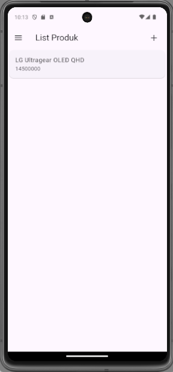

# Toko Kita
Tugas Praktikum Pertemuan 4 dan 5 membuat CRUD Produk dari sebuah toko secara sederhana dengan menggunakan CI4 dan flutter.

## Pertemuan 4

Dokumentasi tugas praktikum prak mobile pertemuan 4.


### Screenshots

<p>
  
  
  
  
  
  
</p>


## Pertemuan 5

Dokumentasi tugas praktikum prak mobile pertemuan 5.


### 1. Proses Registrasi

<p style="display: flex; justify content: center;">
  
  
</p>


- Halaman memiliki beberapa TextFields untuk input nama, email, dan password, termasuk konfirmasi password.
- Setiap TextField memiliki validasi untuk memastikan input memenuhi kriteria, misalnya, nama harus minimal 3 karakter, email harus valid, dan password minimal 6 karakter.
- Tombol "Registrasi" akan memeriksa validasi formulir terlebih dahulu.
- Jika valid, tombol akan memanggil fungsi `_submit()` untuk mengirim data registrasi.
- Fungsi `_submit()` menggunakan `RegistrasiBloc` untuk mengirim data ke backend dan menampilkan dialog.
- Jika registrasi berhasil, dialog sukses akan muncul, meminta pengguna untuk login.
- Jika gagal, dialog peringatan akan muncul.

<p>
  
</p>

```
RegistrasiBloc.registrasi(
            nama: _namaTextboxController.text,
            email: _emailTextboxController.text,
            password: _passwordTextboxController.text)
        .then((value) {
      showDialog(
          context: context,
          barrierDismissible: false,
          builder: (BuildContext context) => SuccessDialog(
                description: "Registrasi berhasil, silahkan login",
                okClick: () {
                  Navigator.pop(context);
                },
              ));
    }, onError: (error) {
      showDialog(
          context: context,
          barrierDismissible: false,
          builder: (BuildContext context) => const WarningDialog(
                description: "Registrasi gagal, silahkan coba lagi",
              ));
    });

```
- `RegistrasiBloc.registrasi(...)` memanggil fungsi registrasi dari `RegistrasiBloc`, mengirim data nama, email, dan password yang diinput pengguna.
- Fungsi ini menggunakan `then(...)` untuk menangani hasil registrasi:
   - Jika Berhasil: Menampilkan `SuccessDialog` dengan pesan "Registrasi berhasil, silahkan login".
   - Jika Gagal: Menampilkan `WarningDialog` dengan pesan "Registrasi gagal, silahkan coba lagi".
